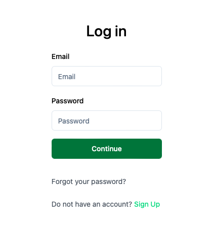
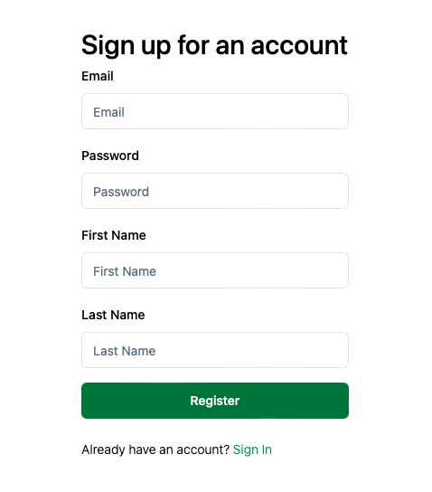

# Intro

Let's discover **Factory AI in less than 5 minutes**.

## Getting Started

Get started by **creating a login**.

### What you'll need

- A modern desktop browser. We recommend Google Chrome and Firefox.

## Creating a login

1. Navigate to https://[customer domain].f7i.ai/login. You can find your [customer domain] in the sign-in instructions.

2. Click "Sign Up".

3. Complete the form and hit register.

    :::info

    Please use your company email address.

    :::

    :::info

    Passwords must be at least 12 characters and contain an uppercase, a lowercase, a numeral and a special character.

    :::

1. To verify your email, we'll send you a code.
1. Great! You're all set. After successfully creating an account, you'll be redirect to the dashboard page.
