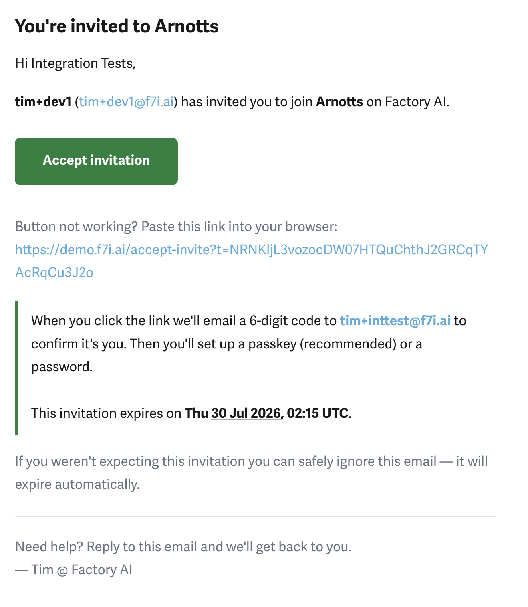
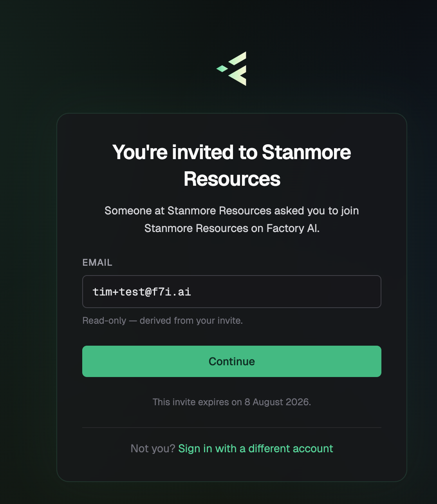
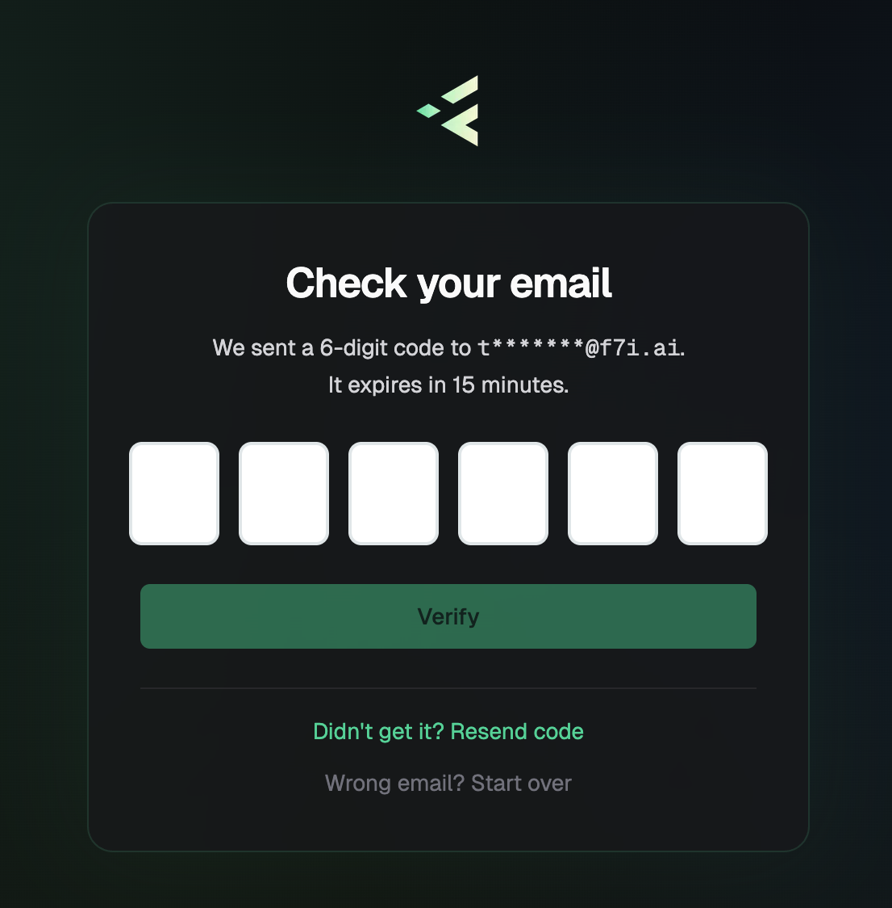
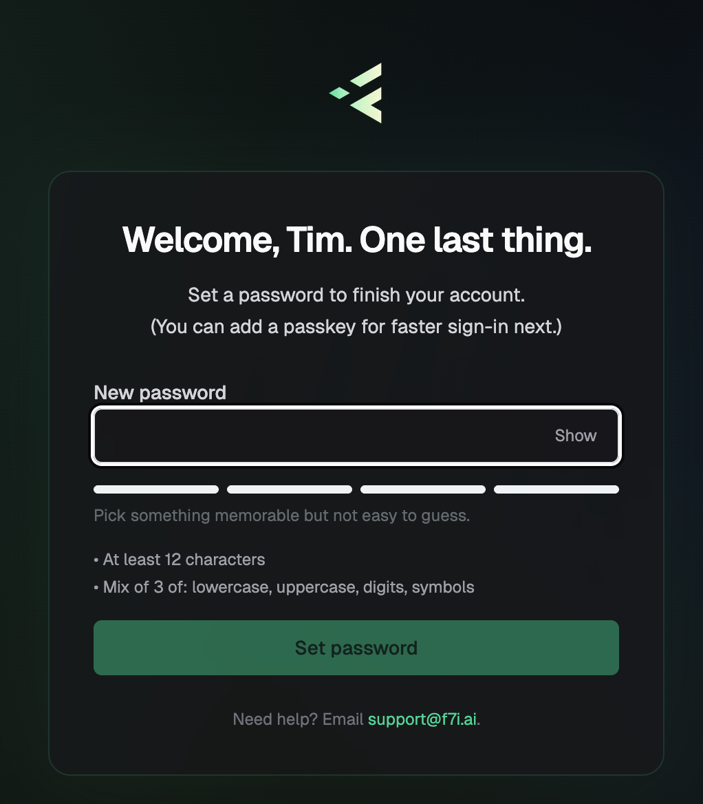
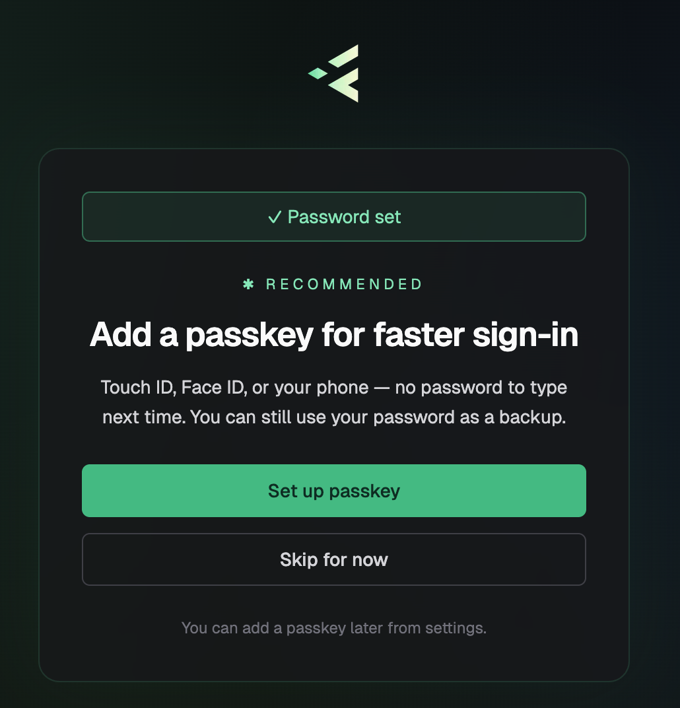

# Accepting Your Invitation

When an administrator invites you to a Factory AI workspace, you'll receive an email with a link to set up your account. This guide walks you through accepting that invitation.

## What you'll need

- A modern desktop or mobile browser (we recommend Google Chrome or Firefox)
- The invitation email from Factory AI
- Access to the email inbox the invite was sent to (you'll receive a verification code there)

## The Invitation Flow

Setting up your account takes about a minute and follows five steps:

1. Open the invitation email and click **Accept invitation**
2. Confirm your email address
3. Enter the 6-digit verification code we email you
4. Set a password
5. (Recommended) Add a passkey for faster sign-in

### Step 1: Open the Invitation Email

You'll receive an email titled **"You're invited to [Workspace Name]"** from Factory AI. The email shows:

- Who invited you (their name and email)
- The workspace you've been invited to join
- A green **Accept invitation** button
- A backup link in case the button doesn't work
- The expiration date for your invitation

Click **Accept invitation** to begin. If the button doesn't work, copy the link below it and paste it into your browser.

:::info Invitation expiry
Invitations expire after a set period (typically 90 days). If your invite has expired, ask the person who invited you to send a new one.
:::

### Step 2: Confirm Your Email

The acceptance page shows the email address tied to your invite. This field is read-only — it has to match the address the invitation was sent to.

1. Verify the email shown is correct
2. Click **Continue**

If the address looks wrong, the invite was sent to a different email. Ask the person who invited you to resend it to the correct address.

### Step 3: Enter the Verification Code

We'll email a **6-digit code** to your address to confirm it's really you. The code expires in **15 minutes**.

1. Open the email titled **"Your Factory AI verification code"**
2. Enter the 6 digits into the code field
3. Click **Verify**

If you don't see the email:

- Check your spam or junk folder
- Click **Didn't get it? Resend code** to request a new one
- Click **Wrong email? Start over** if you need to use a different inbox

### Step 4: Set a Password

After verification, you'll be welcomed by name and asked to set a password.

1. Type a new password into the **New password** field
2. Watch the strength meter — it fills as your password gets stronger
3. Click **Set password**

:::info Password requirements
- At least **12 characters**
- A mix of **at least 3** of the following: lowercase letters, uppercase letters, digits, symbols
:::

:::tip
Pick something memorable but not easy to guess. A passphrase made of unrelated words (with a number and symbol) is both strong and easy to remember.
:::

### Step 5: Add a Passkey (Recommended)

Once your password is saved, we'll offer to set up a passkey. **We strongly recommend it** — passkeys let you sign in with Touch ID, Face ID, Windows Hello, or your phone, with no password to type.

You have two options:

- **Set up passkey** — your browser will prompt you to authenticate with your device's biometrics or security key
- **Skip for now** — you can add a passkey later from **Settings → Security**

Your password still works as a backup either way.

For more on passkeys — supported devices, managing multiple keys, and troubleshooting — see [Setting Up Passkeys](login#setting-up-passkeys-biometric-authentication) in the login guide.

## After Sign-Up

Once your account is set up, you'll land in the workspace you were invited to. From there:

- Your **email and password** are how you sign in next time at `https://[workspace].f7i.ai/login`
- If you set up a **passkey**, you'll be prompted to use it automatically on future logins
- An admin will have already assigned your role and site permissions — no extra setup required

See [Logging into Predict](login) for the regular sign-in flow.

## Troubleshooting

**The "Accept invitation" button doesn't work**
- Copy the backup link below the button and paste it into your browser
- Make sure you're opening the link in the same browser you'll use to sign in

**The email field is wrong on the acceptance page**
- The invite is tied to a specific email address — that field can't be edited
- Ask the person who invited you to send a new invite to your correct address

**6-digit code didn't arrive**
- Check your spam or junk folder
- Confirm the masked email shown on the verification screen is the inbox you have access to
- Click **Resend code** — it's safe to do this more than once
- If it still doesn't arrive after a few minutes, contact support

**"Code expired" or "invalid code" error**
- Codes expire after 15 minutes — request a new one with **Resend code**
- Make sure you're entering the code from the most recent email, not an older one

**My password isn't accepted**
- Check the requirements: 12+ characters, mix of 3 of (lowercase, uppercase, digits, symbols)
- Watch the strength meter — if it stays empty, you don't yet meet the requirements

**The invitation has expired**
- Ask the person who invited you to send a fresh invite
- Expired invites can't be renewed — a new one will be issued

## Need Help?

If you get stuck, email [support@f7i.ai](mailto:support@f7i.ai) or reply directly to your invitation email — we'll get back to you.
