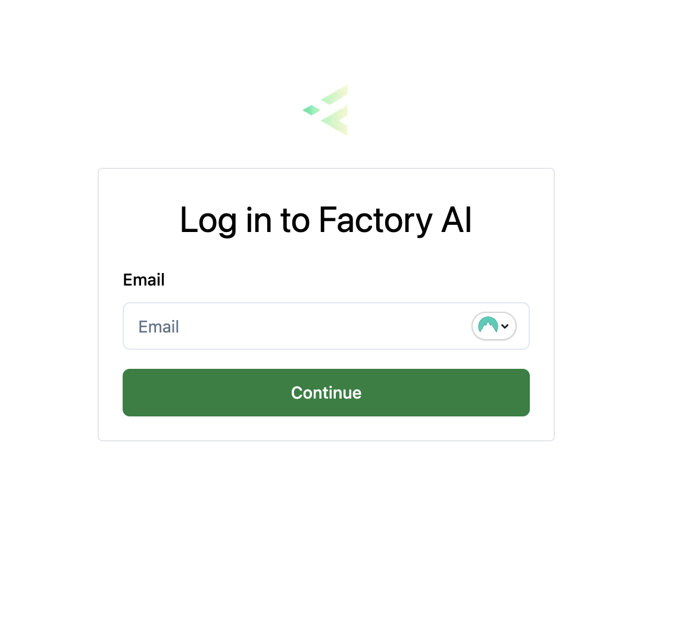
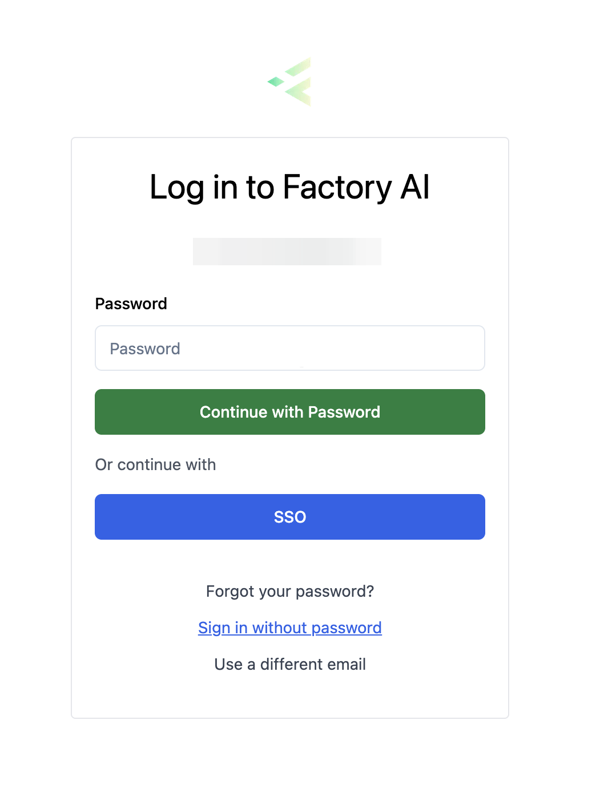

# Logging into Predict

Get started with Factory AI Predict by logging into your account. Our multi-step authentication system provides multiple secure ways to access your predictive maintenance platform.

## What you'll need

- A modern desktop browser (we recommend Google Chrome or Firefox)
- Your Factory AI account credentials
- Access to your email for passwordless authentication (optional)
- A registered passkey device for advanced authentication (optional)

## Login Process

Factory AI Predict uses a modern, multi-step authentication system that adapts to your available authentication methods.

### Step 1: Navigate to Login

1. Navigate to `https://[customer-domain].f7i.ai/login`
2. You can find your customer domain in the sign-in instructions sent via email

### Step 2: Enter Your Email

1. Enter your email address in the email field
2. Click **Continue** to proceed to the next step

The system will automatically check for available authentication methods for your account.

### Step 3: Authentication Method

After entering your email, the system checks what authentication methods are available for your account:

#### Biometric Authentication (If Available)

If you have biometric authentication set up on your account, the system will automatically prompt you to authenticate using your biometrics:

1. Your browser will prompt you to use your registered biometric authentication
2. Use your fingerprint, face ID, or security key as configured
3. You'll be automatically signed in upon successful authentication

If biometric authentication fails or times out, you'll be redirected to the password authentication step.

#### Password Authentication (Default)

If you don't have biometric authentication set up, or if biometric authentication fails, you'll see the password authentication screen:

1. Enter your password in the password field
2. Click **Continue with Password** to sign in

From this screen, you also have additional authentication options:

##### Email OTP (Passwordless Login)
1. Click **Sign in without password** 
2. **Re-enter your email address** when prompted
3. Click **Send Email Code**
4. You'll receive an **8-digit code** via email
5. Enter the code to complete authentication

##### Forgot Password
1. Click **Forgot your password?**
2. **Re-enter your email address** when prompted  
3. Click **Send Reset Code**
4. Check your email for password reset instructions
5. Follow the link to create a new password

#### SSO (Single Sign-On)

If your organization has SSO configured:

1. From the password step, click **SSO**
2. You'll be redirected to your organization's identity provider
3. Sign in with your corporate credentials
4. You'll be redirected back to Factory AI Predict

:::info Password Requirements
Passwords must be at least 12 characters and contain:
- An uppercase letter
- A lowercase letter  
- A number
- A special character
:::

### Email Verification (8-Digit Code)

When using Email OTP (passwordless login):

1. After re-entering your email address, check your email for an **8-digit verification code**
2. Enter the 8-digit code in the verification field
3. Click **Verify** to complete authentication

## First-Time Login

If this is your first time logging in:

1. Use the temporary credentials sent in your welcome email
2. You'll be prompted to set a new password
3. Follow the password requirements shown above
4. Once completed, you'll be redirected to the Predict dashboard

## Troubleshooting

### Common Issues

**Email not recognized**
- Verify you're using the correct email address
- Check if you need to sign up for an account first
- Contact your administrator if you should have access

**Password not working** 
- Use the "Forgot your password?" link to reset (you'll need to re-enter your email)
- Ensure caps lock is off
- Check for any browser auto-fill issues

**Biometric authentication fails**
- Try the authentication again if prompted
- Ensure your device supports biometric authentication
- Check browser permissions for biometric authentication
- You'll automatically fall back to password authentication

**8-digit email code not received**
- Check your spam/junk folder
- Verify your email address was entered correctly when prompted
- Wait a few minutes and try requesting a new code
- Contact support if issues persist

### Browser Compatibility

For the best experience with advanced authentication features:
- **Chrome/Edge**: Full support for all authentication methods
- **Firefox**: Full support for all authentication methods  
- **Safari**: Basic support (password and email verification)

## Security Features

Factory AI Predict implements several security measures:

- **Adaptive authentication**: Automatically detects available authentication methods
- **Multi-factor authentication (MFA)**: Support for biometric authentication and email verification
- **Biometric authentication**: Advanced passwordless security using device biometrics
- **Email verification**: 8-digit codes for passwordless authentication
- **Session management**: Automatic logout after inactivity
- **Secure transmission**: All data encrypted in transit
- **Progressive fallback**: Graceful degradation from biometric to password authentication

After successful authentication, you'll be redirected to the Factory AI Predict dashboard where you can begin monitoring your assets and predictive maintenance insights.

## Setting Up Passkeys (Biometric Authentication)

To enable the fastest and most secure login experience, you can set up passkeys for passwordless biometric authentication. This allows you to sign in using your fingerprint, Face ID, Touch ID, Windows Hello, or hardware security keys.

### What are Passkeys?

Passkeys are a modern, secure authentication method that replaces passwords with cryptographic keys stored on your devices. They provide:

- **Enhanced security**: No passwords to steal or phish
- **Faster login**: Authenticate with a touch or glance
- **Cross-device sync**: Use the same passkey across your devices (depending on your device ecosystem)
- **Privacy protection**: Your biometric data never leaves your device

### Setting Up Your First Passkey

To set up passkey authentication after your initial login:

1. **Access Security Settings**:
   - Navigate to **Settings** → **Security** in the Predict interface
   - Or go directly to `/predict/settings/security`

2. **Add New Passkey**:
   - In the "Passwordless Authentication" section, click **"Add New Passkey"**
   - Enter an optional nickname to identify your device (e.g., "MacBook Touch ID", "YubiKey", "Phone Fingerprint")
   - Click **"Register Passkey"**

3. **Complete Device Authentication**:
   - Your browser will prompt you to authenticate using your device's available methods:
     - **Touch ID/Face ID** (Mac/iOS devices)
     - **Windows Hello** (Windows devices with biometric sensors)
     - **Fingerprint scanner** (Android devices)
     - **Hardware security key** (YubiKey, etc.)
   - Follow the prompts to complete registration

4. **Confirmation**:
   - Once registered, your passkey will appear in the security settings
   - You can now use this passkey for future logins

### Supported Devices and Methods

#### Platform Authenticators (Built-in)
- **macOS**: Touch ID, Face ID (on supported Macs)
- **iOS**: Touch ID, Face ID
- **Windows**: Windows Hello (fingerprint, face recognition, PIN)
- **Android**: Fingerprint, face unlock, screen lock

#### Hardware Security Keys
- **YubiKey** (USB-A, USB-C, NFC, Lightning)
- **Google Titan Security Key**
- **Modern security keys** (FIDO2-compatible)
- **Hardware authenticators** (CTAP2-compliant)

### Managing Your Passkeys

From the Security Settings page, you can:

- **View all registered passkeys** with their nicknames and registration dates
- **Rename passkeys** to help identify them (click the edit icon)
- **Remove passkeys** you no longer use (click the trash icon)
- **See device types** (Hardware Key, Device Biometric, Security Key)
- **Check last used dates** for security monitoring

### Using Passkeys for Login

Once set up, passkeys work automatically:

1. Enter your email on the login page
2. If you have passkeys registered, you'll be **automatically prompted** to authenticate
3. Use your biometric method or security key when prompted
4. You'll be signed in immediately upon successful authentication

If passkey authentication fails or times out, you'll automatically fall back to the password authentication screen.

### Best Practices

- **Register multiple passkeys**: Set up passkeys on different devices for backup access
- **Use descriptive nicknames**: "MacBook Touch ID", "iPhone Face ID", "Work YubiKey"
- **Keep passkeys active**: Regularly use your registered devices to ensure they remain functional
- **Remove old devices**: Delete passkeys for devices you no longer use

### Troubleshooting Passkey Setup

**Browser not prompting for passkey registration**
- Ensure you're using a modern browser (Chrome 67+, Firefox 60+, Safari 14+, Edge 18+)
- Check that your device supports biometric authentication
- Verify browser permissions for authentication

**Biometric authentication not working**
- Ensure your device's biometric sensors are configured and working
- Check that you're signed into your device's biometric system
- Try using a different authentication method (PIN, pattern, password)

**Hardware key not recognized**
- Ensure your security key supports modern authentication standards
- Try different USB ports or connections
- Check for firmware updates for your security key

### Security Notes

- **Your biometric data never leaves your device** - only cryptographic signatures are sent
- **Passkeys are unique per website** - they cannot be used to track you across sites
- **Devices store passkeys securely** - they're protected by your device's secure enclave
- **No shared secrets** - even Factory AI cannot access your passkey data

Ready to set up your passkeys? Navigate to **Settings** → **Security** in the Predict interface after logging in!
