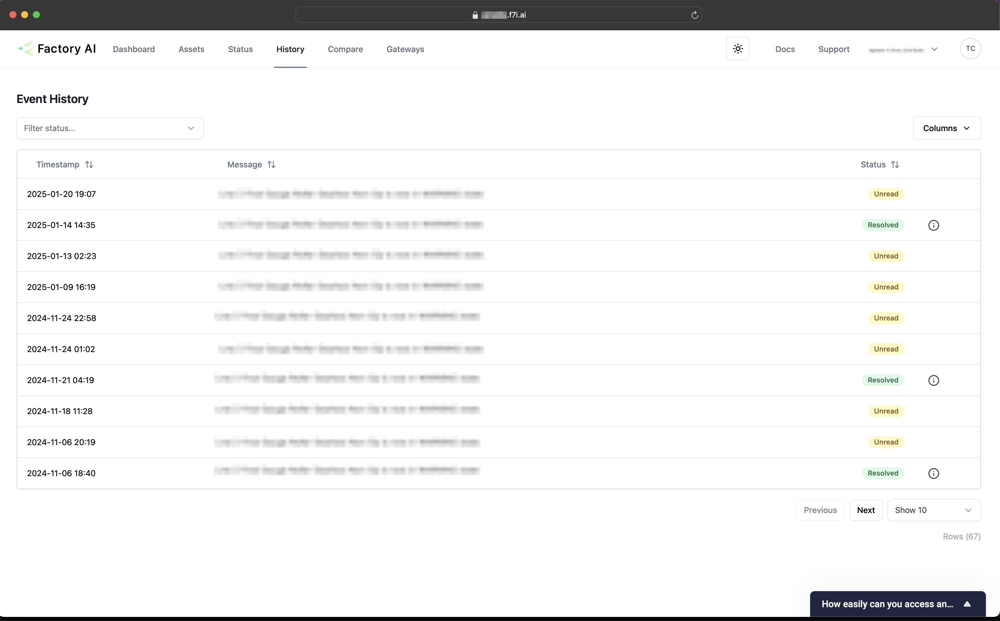

# Historical Information
## Event Log

## Annotating charts
You can add labels or annotations to the chart with related information. For example, if there has been a power outage, you might want to create a label to show why the data during a period is different.
To add a note, simply click the "+ Add Note" button on the sensor page.

## History of alerts
A log of all anomalies with their status and resolution details can be found on the history page.
