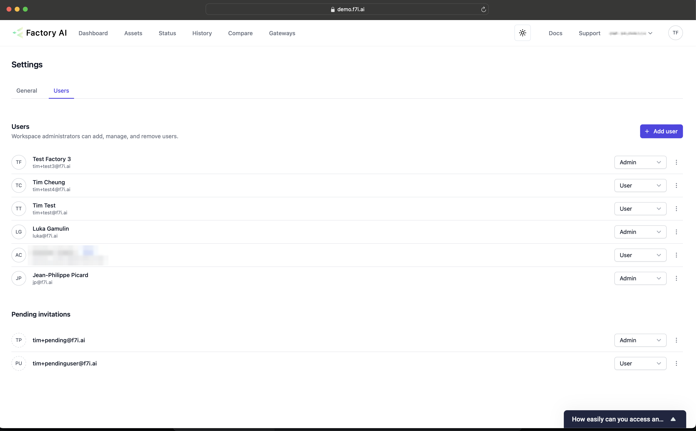
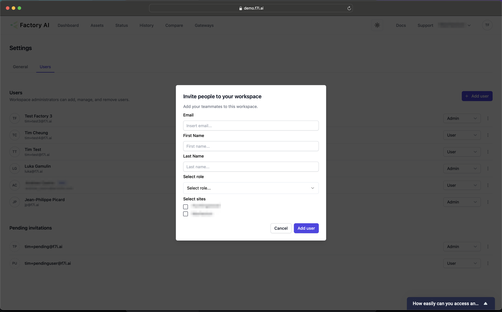

# User Management
:::info
This is for Factory AI Administrators only
:::

## Managing Users
Admins can invite, remove and manage the roles of users that have access to Factory AI.

1. You can navigate to the user page, by clicking the top right avatar icon (your initials), clicking Settings. 
1. Then in the middle of the page selecting the user tab.

## Adding Users
To add a user: 
1. Click the "Add User" button.
1. Fill in all the fields
    1. At least one site must be selected.
1. Click add user.
1. The user will receive an email invitation with a link to set up their account. The invitation walks them through verifying their email, setting a password, and optionally adding a passkey — see [Accepting Your Invitation](/docs/predict/getting-started/accept-invite) for the user's view of the flow.
:::tip
Invitations expire if not accepted within the configured window. If a user's invite has expired, you'll need to send a new one from the user list.
:::

## Removing Users
1. To remove users, simply click the triple dot icon to the right of the user, and select delete or revoke invitation.