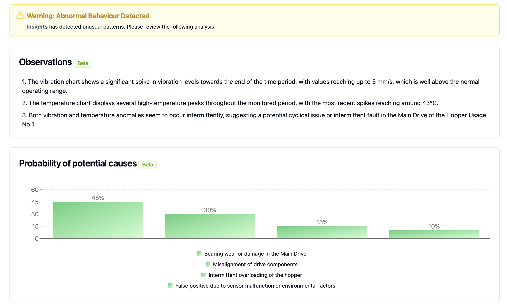
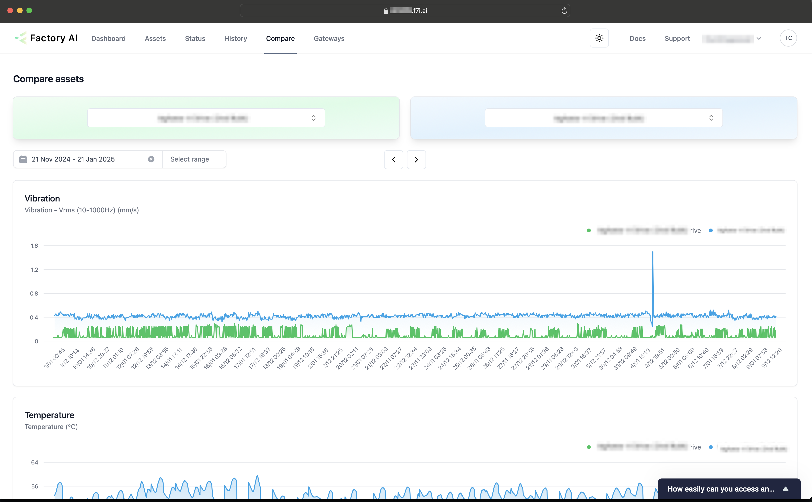

# Analysing Data

## Overview
We currently offer two views of the chart data. At the asset view and on a sensor view.

## Asset Charts
Allow you to compare data across an asset. This is useful to compare data on different sides of an asset.

## Filtering data
By default, all data is shown, to filter for a more recent or specific time period, use the calendar or quick filters.

## Further analysis of sensor data
To see more detailed view of the sensor data, navigate to the sensor page of an asset as described [here](/docs/training-software/find-assets#finding-the-sensors-for-an-asset)

## Insights
When anomalies are detected, our AI powered insights module analyses the data along with other contextual information to generate an intial report to reduce analysis time.

As these findings are AI-generated, please provide feedback on their accuracy and usefulness. With your feedback we can improve the reports.

## Comparing Assets
Analyse asset performance against other assets. This might help identity poorly operating equipment and eliminate defects.

