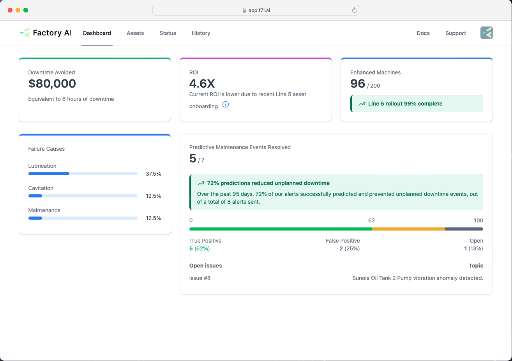

# Dashboard

## Overview
The Dashboard is designed to provide engineers, maintenance and management teams with a comprehensive summary of the asset health at their site(s).

## Key Features
### 1. Metrics Display
**Description:** View essential metrics such as downtime avoided and ROI for different sites. Track the roll out of enhanced assets across the site.

### 2. Issue Tracking
**Description:** Keep track of events in the maintenance process. View a summary of the on-going issues as well as past events.

### 3. Failure causes
**Description:** A summary of the different causes of failure

## User Tips
**Support**: For any issues or questions, contact the Factory AI team in the top right.

**Feedback**: Have a suggestion or feedback? We want to hear from you. Use the support function in the top right of the app.

### Troubleshooting
If the dashboard is not updating, check your network connection and try refreshing the page.
If the error still occurs, try clearing the browser cache and logging back in again.