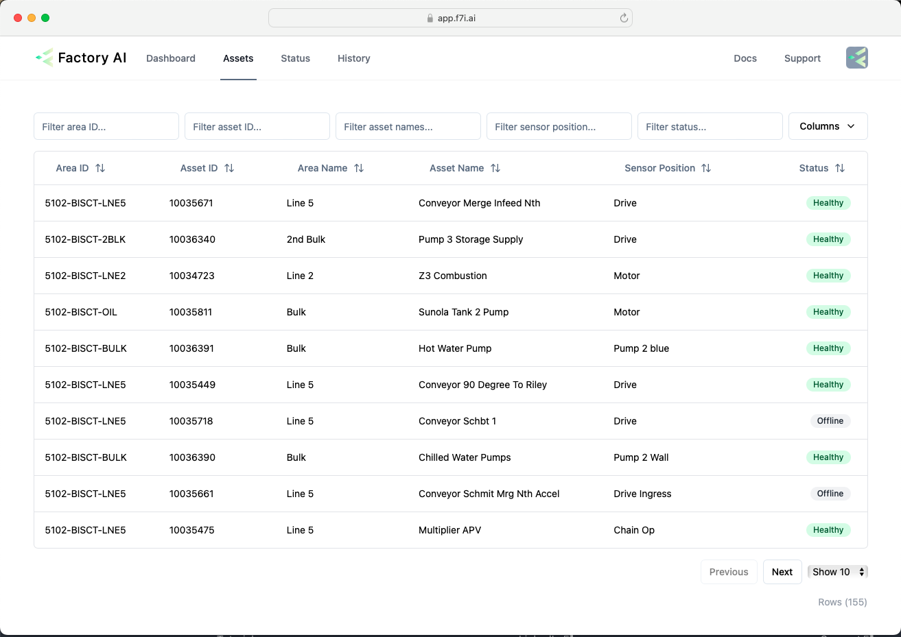
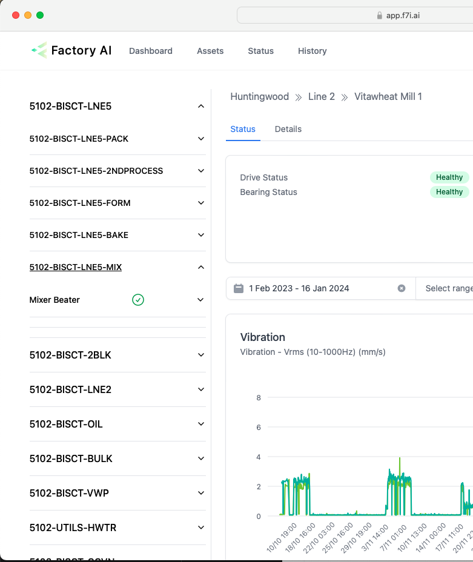

# Finding assets

We've really focused on making it easy to find data quickly. We provide you with multiple ways to navigate between different assets.

## List of all assets
Starting with the asset page, where you'll find a list of all the assets. You can use one or more of the filters in the top row, to quickly find different assets.
Want to find all the mixer beater motors? Simply put in **mixer beater** into the asset name filter and **motor** into the sensor position filter, this will show multiple mixer beaters across the lines.

## Navigating to other assets from an asset page
On the asset detail page, you can also find other assets by using the left hand nav. Assets are organised by area.

## Finding the sensors for an asset
There are multiple ways to view the sensor data for an asset.
1. In the above image, clicking **Drive Status** or **Bearing Status** takes you to the sensor page.
2. In the left hand navigation, drill down to the sensor view and click the sensor position name.
3. On the asset list page, click the link on the sensor column.

Next, we'll discuss how to analyse data.