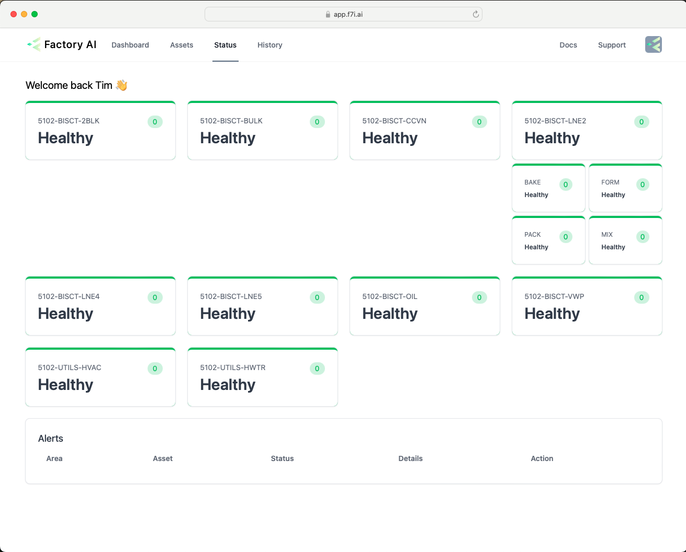
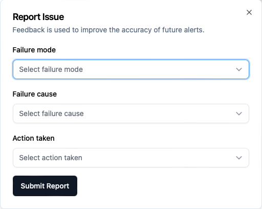
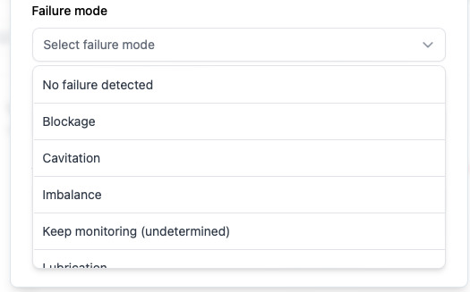
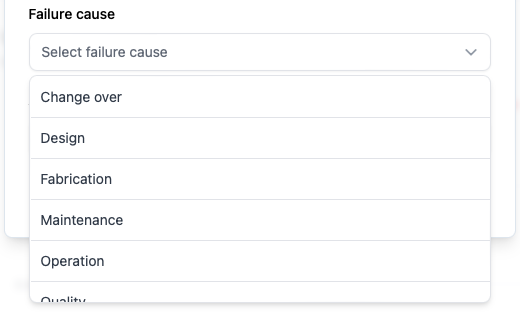
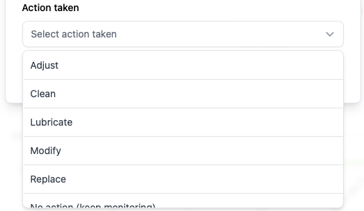

# Resolving issues

## Viewing the current status across the site

The status page provides a high level view of the health of assets.

The top section of the page displays various the overall status organised by areas and subareas, each labeled with the area ID like "5102-BISCT-2BLK" and statuses such as "Healthy", "Warning" or "Alert". You can dive deeper into specific areas by clicking on them, revealing more detailed subareas. The number in each card denotes the number of active issues.

Below the asset health overview, there's a section labeled 'Alerts,' formatted as a table. This part of the dashboard is designed to provide immediate visibility into active issues. It lists alerts by area and asset, includes a status indicator, details of the alert, and an action to manage issues.

## Managing issues
To resolve issues, find the "Resolve Issue" button. This button can be found in the alerts section of the status page, when there is an active issue, as well as on the sensor page of an asset for example "Huntingwood > Line 5 > Conveyor Merge Infeed Nth > **Drive**"

To report an issue with no notification or alarm, find the sensor page for the asset, for example "Huntingwood > Line 2 > Mixer Beater Drive > **Motor**". Click the "Report Issue" button and follow the form to submit feedback. More details on finding assets can be found [here](/docs/training-software/find-assets).

Submitting feedback is easy, once you've clicked the **Resolve** or **Report Issue** button. You'll be presented with a form with 3 questions. 

1. First select the Failure mode

2. Then select the Failure cause

3. The action taken

4. Finally, click **Submit Report** or **Resolve**.

Feedback is used to improve on the accuracy of our alerts.