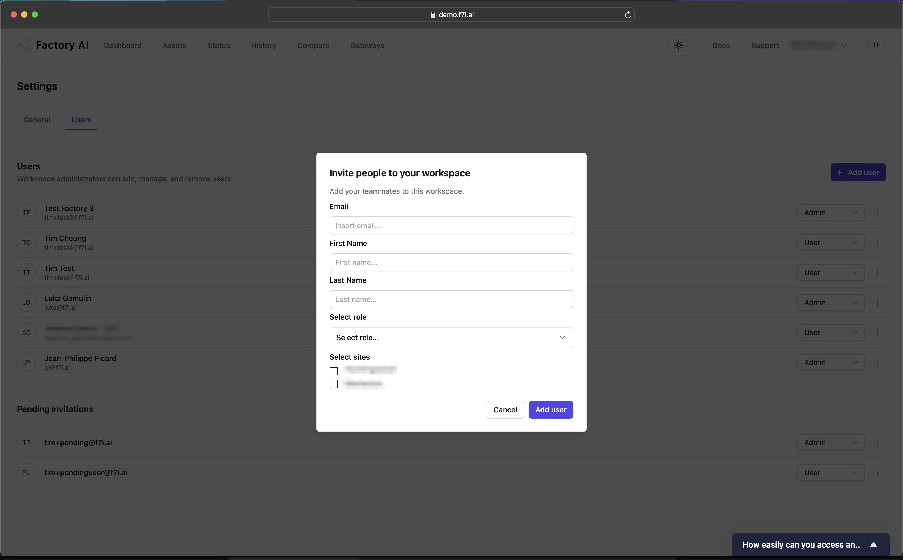

# User Management
:::info
This is for Factory AI Administrators only
:::

## Managing Users
Admins can invite, remove and manage the roles of users that have access to Factory AI.

1. You can navigate to the user page, by clicking the top right avatar icon (your initials), clicking Settings. 
1. Then in the middle of the page selecting the user tab.

## Adding Users
To add a user: 
1. Click the "Add User" button.
1. Fill in all the fields
    1. At least one site must be selected.
1. Click add user.
1. The user will receive an email with their temporary credentials and a link to log in.
:::tip
Temporary credentials will expire after seven days. After that, the user will need to be created again.
:::
1. After the user logs in for the first time, they will be asked to change their password.

## Removing Users
1. To remove users, simply click the triple dot icon to the right of the user, and select delete or revoke invitation.